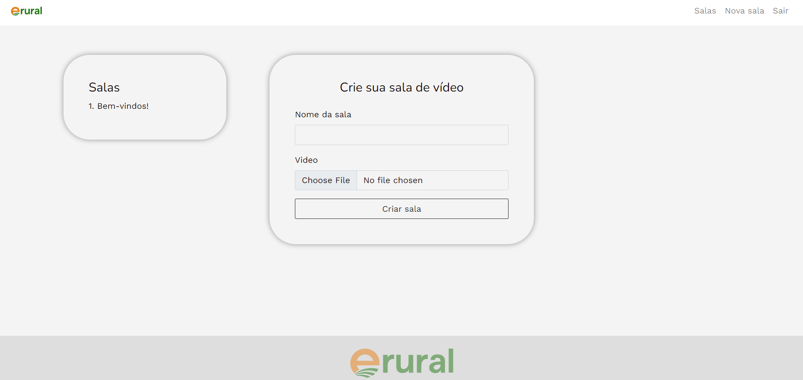

# video-streaming-app

<!---Esses são exemplos. Veja https://shields.io para outras pessoas ou para personalizar este conjunto de escudos. Você pode querer incluir dependências, status do projeto e informações de licença aqui--->

> Aplicação de salas de transmissão de vídeo com mensageria e sala de chat embutida. Usuários podem criar uma sala e fazer o upload de um vídeo local para transmitir para outros usuários. Não é necessário fazer login para criar salas ou assistir vídeos. Para enviar mensagens é necessário apenas digitar nome e sobrenome (soft login).

### Ajustes e melhorias

O projeto ainda está em desenvolvimento e as próximas atualizações serão voltadas para as seguintes tarefas:

- [ ] Melhoria dos testes unitários
- [ ] Dockerização do ambiente de desenvolvimento e do app para produção 🐋
- [ ] Deploy de contâiners no Heroku
- [ ] Implementação de Vue.js e melhorias na interface de usuário ✨

## 💻 Pré-requisitos

Antes de começar, verifique se você atendeu aos seguintes requisitos:
<!---Estes são apenas requisitos de exemplo. Adicionar, duplicar ou remover conforme necessário--->
* Você instalou a versão 3.1.2 de `Ruby`, 7.0.4 de `Ruby on Rails` e 12 de `PostgreSQL`.
* Você tem uma máquina `Linux / Mac` ou está rodando `WSL: Ubuntu`.

## ☕ Usando video-streaming-app

video-streaming-app faz uso do serviço Cloudinary para armazenamento de arquivos enviados.
Certifique-se de que você configurou sua Cloudinary key como variável de ambiente.

## 🚀 Link ao vivo

Heroku: https://videosalas.herokuapp.com/

##

[⬆ Voltar ao topo](#video-streaming-app) 
